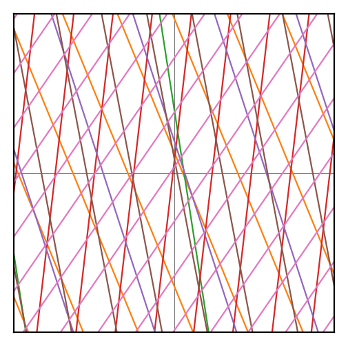
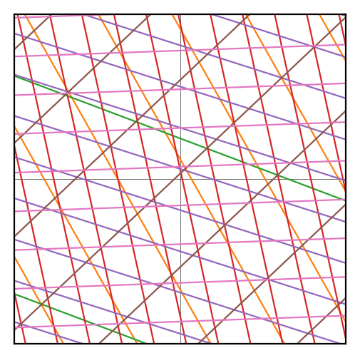
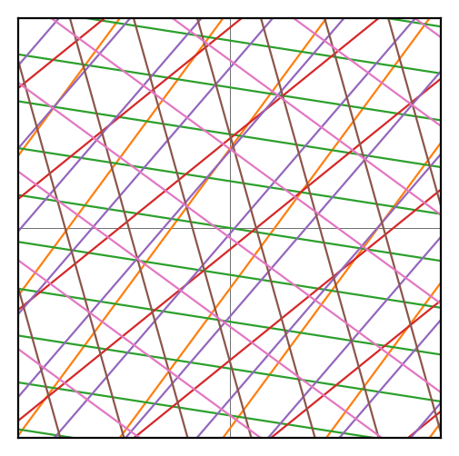
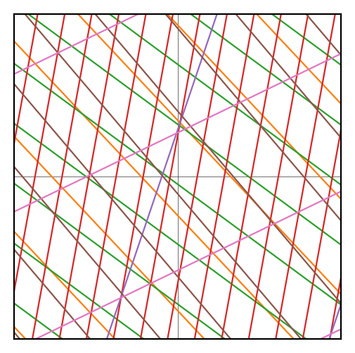
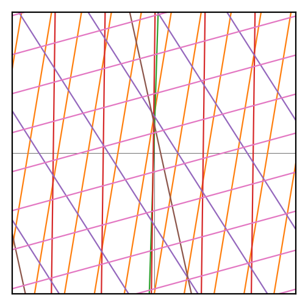
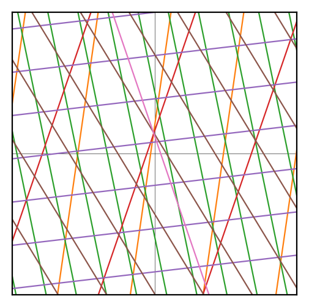
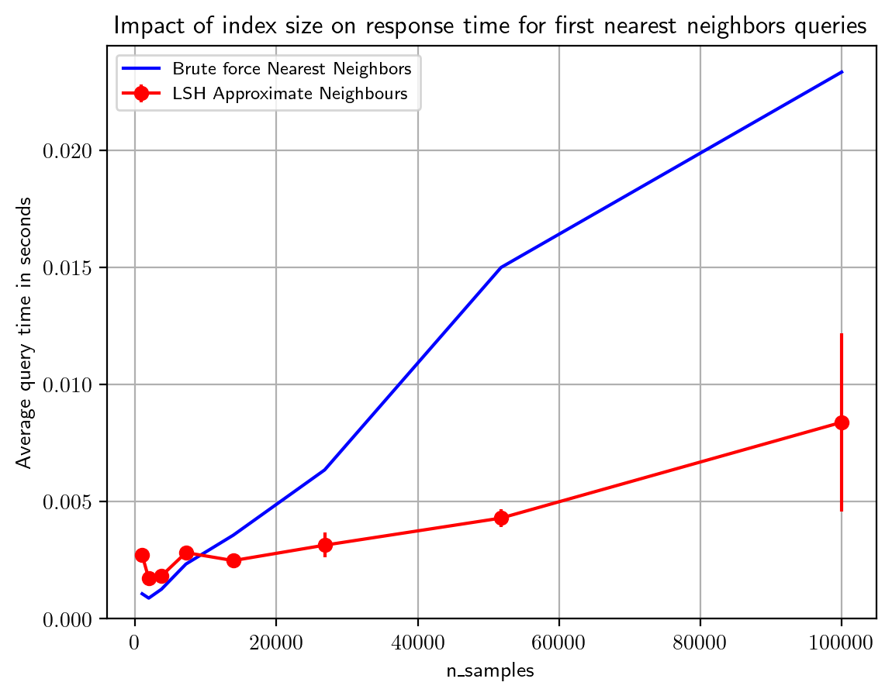
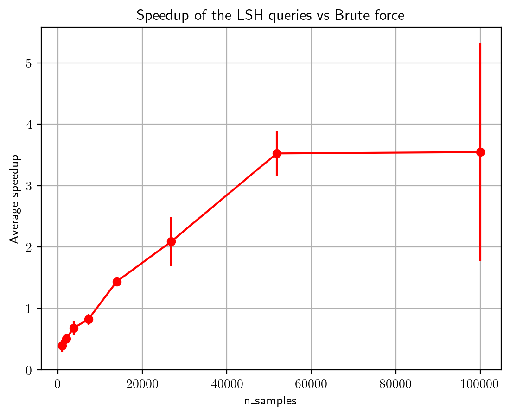
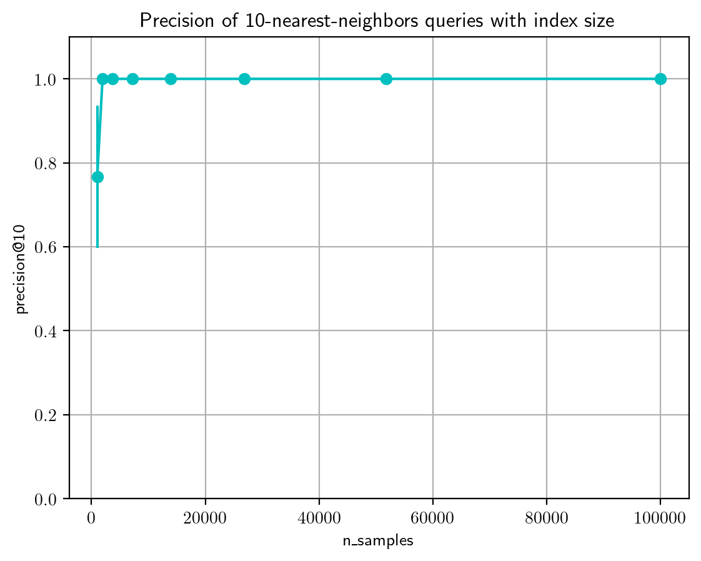

# Hash Function $\mathbb{R}^d \to \mathbb{Z}$ {.smaller}

:::{.fragment}
Suppose $h \sim \mathcal{H}_w$. We have that
:::
:::{.fragment}
$$
h(x) = \left\lfloor \frac{a^Tx + b}{w} \right\rfloor
$$
:::
:::{.fragment}
Where $a \sim \mathcal{N}(\mathbf{0}, I)$ and $b \sim \text{Uniform}[0, w]$
:::

```{python}
#| echo: false
import numpy as np
import matplotlib.pyplot as plt
from sklearn.datasets import make_blobs

plt.rcParams['text.usetex'] = True
plt.rcParams['figure.dpi'] = 200
plt.rcParams['text.latex.preamble'] = r"\usepackage{amsfonts} \usepackage{amsmath}"

rng = np.random.RandomState(42)
```

:::{.fragment}
```{python}
class DatarHashFunction:

  def __init__(self, dim=2, w=1):
    self.w = w
    self.a = np.random.normal(size=dim)
    self.b = np.random.uniform(low=0, high=w)

  def hash(self, x):
    return int((x @ self.a + self.b)/self.w)
```
:::

## Visualize (with $w=1$)

- What sets of values $x$ have the same $h(x)$? (keep $b=0$ for now)

:::{.fragment}
$$
c \le a^Tx_1, a^Tx_2 < c+1 \implies h(x_1) = h(x_2)
$$

for some $c \in \mathbb{Z}$
:::

- What does this look like on a graph?


## {.smaller}

```{=html}
<iframe src="hyperplane.html" width="100%" height="500px"></iframe>
```

- $x_1, x_2 \in \text{ region between these lines} \implies h(x_1) = h(x_2)$
- Distance between the lines $=\frac{1}{|a|}$
- Not enough. Has high `False Positive Rate`

# LSH Table $\mathbb{R}^d \to \mathbb{Z}^k$ {.smaller}

- Concatenation of $k$ hash functions $h_1, \dots, h_k \sim \mathcal{H}_w$;

:::{.fragment}
$$
g(x) = \begin{bmatrix} h_1(x) & h_2(x) & \dots & h_k(x) \end{bmatrix}
$$
:::

:::{.fragment}
```{python}
class LSHTable:

  def __init__(self, dim=2, w=4, k=5):
    self.k = k
    self.table = [DatarHashFunction(dim, w) for _ in range(k)]

  def hash(self, x):
    return tuple(h.hash(x) for h in self.table)
```
:::
- What sets of values $x$ have the same $g(x)$?

## {.smaller}

- Some strict regions, `True Positive Rate` suffers

```{=html}
<iframe src="anim.html" width="100%" height="92%"></iframe>
```

## LSH {.nostretch .smaller}

- Maintain $L$ such tables. Collision if any one of the tables match.

::: {layout-ncol=3}
{width="250px"}

{width="250px"}

{width="250px"}

{width="250px"}

{width="250px"}

{width="250px"}
:::

## {.smaller auto-animate="true"}

```{python}
class LSH:

  def __init__(self, dim=2, w=2, k=5, L=5):
    self.L = L
    self.tables = [LSHTable(dim, w, k) for _ in range(L)]
    self.hashtable = [dict() for _ in range(L)]
```

## {.smaller auto-animate="true"}

```{python}
class LSH:

  def __init__(self, dim=2, w=2, k=5, L=5):
    self.L = L
    self.tables = [LSHTable(dim, w, k) for _ in range(L)]
    self.hashtable = [dict() for _ in range(L)]

  def fit(self, data):
    for x in range(len(data)):
      for i, t in enumerate(self.tables):
        h = t.hash(data[x])

        if h not in self.hashtable[i]:
          self.hashtable[i][h] = []

        self.hashtable[i][h].append(x)
```

## {.smaller auto-animate="true"}

```{python}
class LSH:

  def __init__(self, dim=2, w=2, k=5, L=5):
    self.L = L
    self.tables = [LSHTable(dim, w, k) for _ in range(L)]
    self.hashtable = [dict() for _ in range(L)]

  def fit(self, data):
    for x in range(len(data)):
      for i, t in enumerate(self.tables):
        h = t.hash(data[x])

        if h not in self.hashtable[i]:
          self.hashtable[i][h] = []

        self.hashtable[i][h].append(x)

  def find_candidates(self, query):
    candidates = []
    for i, t in enumerate(self.tables):
      h = t.hash(query)
      candidates.extend(self.hashtable[i].get(h, []))
    return np.unique(candidates)
```

## Brute force NN vs LSH ANN {.smaller}

::: {.panel-tabset}

### Time

{width="600px"}

### Speedup

{width="600px"}

### Precision@10

{width="600px"}

:::


<!-- ## In action

```{python}
#| echo: false

data, _ = make_blobs(n_samples=120, centers=4, random_state=rng)
data, query = data[:100], data[100:]
query_point = query[0]
```

```{python}
#| echo: false

sample_lsh = LSH(dim=2, w=3)
sample_lsh.fit(data)
``` -->